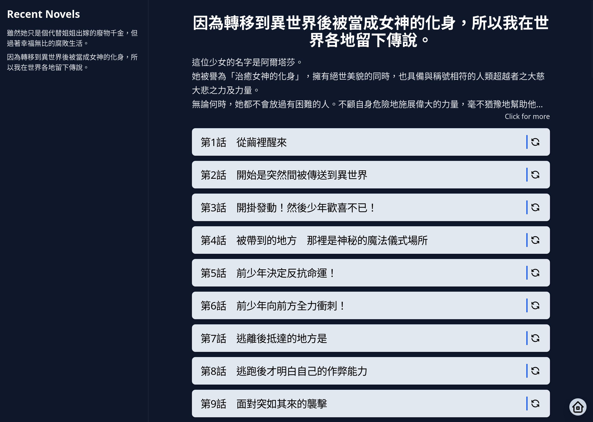

# novel-tralslate

[](https://wakatime.com/badge/user/6c7a0447-9414-43ab-a937-9081f3e9fc7d/project/30132cd0-1c6e-4914-84e4-3e8bac06ea3c)

> [!NOTE]
> 這裡是程式碼的鏡像，開發在私人的Gitea，可以開issue尋問

## 功能

- 手機最佳化：為小螢幕畫面優化UX，支持手勢翻頁
- 低延遲低網路需求：使用混合式服務器渲染(Hydration SSR)，只要8kb就可以渲染頁面
- 支援多個小說網站：支持`アルファポリス`, `カクヨム`, `小説家になろう`,
  `ハーメルン`
- 支持多個翻譯器(大型語言模型)：SakuraLLM, Google Gemini

## 成果展示



|                 Home Page                  |                 Novel Page                  |                 Article Page                  |
| :----------------------------------------: | :-----------------------------------------: | :-------------------------------------------: |
|  |  |  |
|               Home Page Dark               |               Novel Page Dark               |               Article Page Dark               |
|   |   |   |

## 安裝

使用docker compose，打開`./docker`

```shell
git clone https://github.com/Eason0729/novel-tralslate.git
# git checkout tags/vX.X.X
cd docker
sudo docker compose up
```
